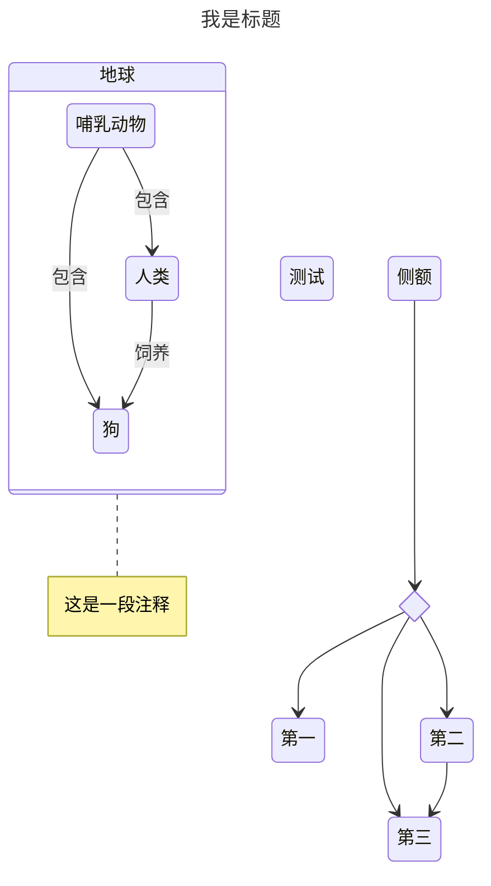

```mermaid
---
title: 我是标题
---
stateDiagram-v2

state SC <<choice>>

S0:地球
S1:人类
S2:哺乳动物
S3:狗

S4:测试

state S0 {
    S2 --> S1:包含
    S2 --> S3:包含
    S1-->S3:饲养
}

note right of S0
    这是一段注释
end note


侧额-->SC
SC-->第一
SC-->第二
SC-->第三
第二-->第三


```
