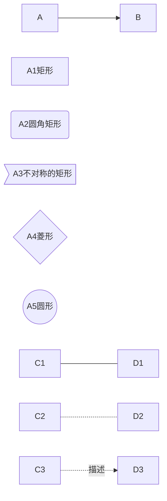

## <center><font face="黑体">一、标题</font></center>
1. 使用#表示标题，#必须在行首，后面有一个空格

# 一级标题  
## 二级标题
### 三级标题
#### 四级标题
##### 五级标题
###### 六级标题

2.使用---（二级标题）或者===（一级标题），在标题下方

一级标题
===
二级标题
---

-----

## <center><font face="黑体">二、分割线</font></center>

使用三个以上的---或者***

-----

## <center><font face="黑体">三、斜体和粗体和删除线</font></center>

\*斜体\*，\*\*粗体\*\*，\*\*\*又斜又粗\*\*\*，\~\~删除文字\~\~

*斜体*，**粗体**，***又斜又粗***，~~删除文字~~


--------

## <center><font face="黑体">四、超链接和图片</font></center>

超链接：\[链接文字](超链接地址)  
超链接：[链接文字](超链接地址)

图片: \![图片文字]\(图片地址)  
图片:   

-----

## <center><font face="黑体">五、无序和有序列表</font></center>

1.无序列表  
使用-、+、*，前后留一空格

- 水果
  + 多汁
    * 梨
    * 葡萄
  + 少汁
    * 菠萝蜜
    * 香蕉
- 肉类
- 碳水


2.有序列表   
使用1. （数字.）前后面有一个空格

1. 中国
   1. 北京
      1. 东城区
      2. 朝阳区  
   2. 上海
2. 美国
3. 德国
4. 日本

-----

## <center><font face="黑体">六、文字引用</font></center>

\>表示文字引用,可以使用多个>

>引用文字
>>引用引用的文字
>>>引用引用的引用的文字


## <center><font face="黑体">七、代码块</font></center>

1.行内代码块  
使用\`  

我这里是一段文字，中间有一个变量`var a = 'a'`是一段代码块

2.代码块  
使用\`\`\`

代码块如下：
```javascript
var a = 'a'
var b= 'b'
if(a == b) {
    console.log('a等于b')
} else {
    console.log('a不等于b')
}
```

3. 代码块diff效果
```diff
function addTwoNumbers (num1, num2) {
-  return 1 + 2
+  return num1 + num2
}
```


## <center><font face="黑体">八、表格</font></center>

第二行为对齐方式：-左对齐，-:右对齐，:-:居中对齐

|商品|数量|单价|
|-|-:|:-:|
|苹果|10|\$1|
|电脑|1|\$1000|


## <center><font face="黑体">九、流程图</font></center>

主要语法为`name=>type: describe`，其中type主要有以下几种：  
1. 开始和结束:`start、end`
2. 输入和输出:`inputoutput`
3. 操作:`operation`
4. 条件:`condition`
5. 子程序:`subroutine`


```flow
st=>start: 开始框
op=>operation: 处理框
cond=>condition: 判断框(是或否?)
sub1=>subroutine: 子流程
io=>inputoutput: 输入输出框
e=>end: 结束框
st->op->cond
cond(yes)->io->e
cond(no)->sub1(right)->op
```


```flow
st=>start: 开始框
op=>operation: 处理框
cond=>condition: 判断框(是或否?)
sub1=>subroutine: 子流程
io=>inputoutput: 输入输出框
e=>end: 结束框
st(right)->op(right)->cond
cond(yes)->io(bottom)->e
cond(no)->sub1(right)->op   
```

-----

## <center><font face="黑体">十、流程图</font></center>

\```mermaid
graph 流程图方向
   流程图内容
\```   

##### 流程图方向：

TB 从上到下
BT 从下到上
RL 从右到左
LR 从左到右
TD 同TB

##### 基本图形
id + [文字描述]矩形
id + (文字描述)圆角矩形
id + >文字描述]不对称的矩形
id + {文字描述}菱形
id + ((文字描述))圆形


##### 节点之间的连接
A --> B A带箭头指向B
A --- B A不带箭头指向B
A -.- B A用虚线指向B
A -.-> B A用带箭头的虚线指向B
A ==> B A用加粗的箭头指向B
A -- 描述 --- B A不带箭头指向B并在中间加上文字描述
A -- 描述 --> B A带箭头指向B并在中间加上文字描述
A -. 描述 .-> B A用带箭头的虚线指向B并在中间加上文字描述
A == 描述 ==> B A用加粗的箭头指向B并在中间加上文字描述




<font color=#FF0000 >注意：如果mermaid图颜色是黑色的，在vscode中，搜索设置项mermaid theme，将markdown-preview-enhanced.mermaidTheme设置为："mermaid.dark.css"或"mermaid.forest.css"</font>


## <center><font face="黑体">十一、Html空格、文字居中等</font></center>

1. 空格
&nbsp;&nbsp;不断行的空白格
&ensp;&ensp;半方大的空白
&emsp;&emsp;全方大的空白
```
&nbsp;&nbsp;不断行的空白格&nbsp;或&#160;
&ensp;&ensp;半方大的空白&ensp;或&#8194;
&emsp;&emsp;全方大的空白&emsp;或&#8195;
```

1. 文字居中
<center><font face="黑体">文字黑体居中</font></center>
```
<center><font face="黑体">文字黑体居中</font></center>
```

3. 字号颜色
<font size=3 >3号字</font>
<font size=4 >4号字</font>
<font color=#FF0000 >红色</font>
<font color=#008000 >绿色</font>
<font color=#0000FF >蓝色</font>
```
<font size=3 >3号字</font>
<font size=4 >4号字</font>
<font color=#FF0000 >红色</font>
<font color=#008000 >绿色</font>
<font color=#0000FF >蓝色</font>
```

4. 空白行

内容1<br/><br/><br/><br/>内容2
```
内容1<br/><br/><br/><br/>内容2
```

5. 背景色
<table><tr><td bgcolor=orange> 背景色是 1 orange</td></tr></table>

```
<table><tr><td bgcolor=orange> 背景色是 1 orange</td></tr></table>
```

6. 页内锚点

```
<h6 id='anchor'>我是一个锚点</h6>

[点我跳转](#anchor)
```

7. 标黄文字
```==标黄文字==```
==标黄文字==

## <center><font face="黑体">十二、多行大括号公式</font></center>

方法一：

$$ f(x)=\left\{
\begin{aligned}
x & = & \cos(t) \\
y & = & \sin(t) \\
z & = & \frac xy
\end{aligned}
\right.
$$

方法二：
$$ F^{HLLC}=\left\{
\begin{array}{rcl}
F_L       &      & {0      <      S_L}\\
F^*_L     &      & {S_L \leq 0 < S_M}\\
F^*_R     &      & {S_M \leq 0 < S_R}\\
F_R       &      & {S_R \leq 0}
\end{array} \right. $$

方法三:
$$f(x)=
\begin{cases}
0& \text{x=0}\\
1& \text{x!=0}
\end{cases}$$

-----

## vsCode插件
Markdown All in One
Markdown Preview Enhanced      
(右键，markdown preview或者编辑器窗体右上方预览图标)